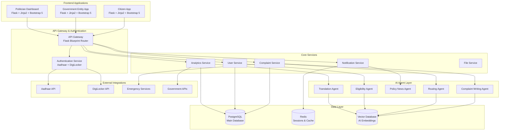
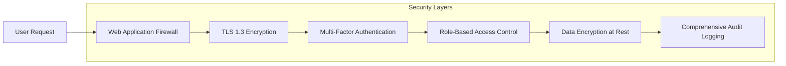

# Design Document: Digital Public Grievance + Welfare + Governance Super-App

## Overview

The Digital Public Grievance + Welfare + Governance Super-App is a comprehensive platform that revolutionizes citizen-government interaction in India through a unified backend serving three distinct role-based applications. The system leverages AI agents for intelligent complaint processing, multi-language support, and real-time analytics to create a transparent, efficient, and accessible governance platform.

The platform follows a microservices-inspired architecture with a shared backend, implementing government-grade security standards while maintaining high performance through a multi-database approach. The system is designed for scalability, supporting millions of users across India with real-time processing capabilities.

## Architecture

### High-Level System Architecture



### Database Architecture

The system employs a multi-database strategy optimized for different data types and access patterns:

**PostgreSQL (Primary Database)**
- User profiles and authentication data
- Complaint records and status tracking
- Government entity information
- Budget and policy data
- Certificate applications and status
- Audit logs and compliance data

**Redis (Session & Cache Layer)**
- User session management
- Real-time notification queues
- Frequently accessed data caching
- Rate limiting and throttling data
- Temporary form data storage

**Vector Database (AI Operations)**
- Complaint embeddings for similarity matching
- Policy document embeddings
- User query embeddings
- AI model training data
- Semantic search indices

### Security Architecture



## Components and Interfaces

### AI Agent Components

#### Complaint Writing Agent
**Purpose**: Converts natural language complaints into formal legal documents
**Input**: Raw user complaint text in any supported language
**Output**: Structured complaint with legal formatting and required fields
**Technology**: Large Language Model with legal document templates

```python
class ComplaintWritingAgent:
    def process_complaint(self, raw_text: str, language: str) -> StructuredComplaint:
        # Convert natural language to formal complaint
        # Apply legal formatting and structure
        # Validate required information completeness
        pass
```

#### Routing Agent
**Purpose**: Automatically categorizes and routes complaints to appropriate departments
**Input**: Structured complaint document
**Output**: Department assignment and priority level
**Technology**: Classification model with government department taxonomy

```python
class RoutingAgent:
    def route_complaint(self, complaint: StructuredComplaint) -> RoutingDecision:
        # Analyze complaint content and context
        # Match against department capabilities
        # Assign priority based on urgency indicators
        pass
```

#### Policy News Agent
**Purpose**: Monitors government announcements and provides simplified explanations
**Input**: Government policy documents and announcements
**Output**: Simplified explanations and citizen impact analysis
**Technology**: Document summarization and impact analysis models

#### Eligibility Agent
**Purpose**: Determines citizen eligibility for government schemes
**Input**: User profile and scheme criteria
**Output**: Eligibility status and required documentation
**Technology**: Rule-based system with ML enhancement for edge cases

#### Translation Agent
**Purpose**: Provides accurate translations between English, Telugu, and Hindi
**Input**: Text in any supported language
**Output**: Accurate translation maintaining context and legal terminology
**Technology**: Specialized translation models for government/legal content

### Core Service Components

#### User Service
**Responsibilities**:
- User registration and profile management
- Aadhaar verification integration
- Role-based access control
- User preference management

**Key Interfaces**:
```python
class UserService:
    def register_user(self, aadhaar_data: AadhaarData) -> User
    def authenticate_user(self, credentials: Credentials) -> AuthToken
    def update_profile(self, user_id: str, profile_data: ProfileData) -> bool
    def get_user_schemes(self, user_id: str) -> List[Scheme]
```

#### Complaint Service
**Responsibilities**:
- Complaint lifecycle management
- AI agent orchestration
- SLA tracking and notifications
- Status updates and communication

**Key Interfaces**:
```python
class ComplaintService:
    def submit_complaint(self, user_id: str, complaint_data: ComplaintData) -> ComplaintID
    def route_complaint(self, complaint_id: str) -> RoutingResult
    def update_status(self, complaint_id: str, status: Status, notes: str) -> bool
    def get_complaint_history(self, user_id: str) -> List[Complaint]
```

#### Analytics Service
**Responsibilities**:
- Real-time analytics generation
- Geographic data processing
- Performance metrics calculation
- Trend analysis and reporting

**Key Interfaces**:
```python
class AnalyticsService:
    def generate_heatmap(self, region: str, filters: AnalyticsFilters) -> HeatmapData
    def calculate_performance_metrics(self, department: str, period: TimePeriod) -> Metrics
    def analyze_sentiment(self, complaints: List[Complaint]) -> SentimentAnalysis
    def generate_politician_dashboard(self, constituency: str) -> DashboardData
```

### Frontend Application Components

#### Citizen App Components
- **Complaint Registration Module**: AI-powered complaint submission with guided forms
- **Emergency Services Module**: One-tap emergency access with location sharing
- **Scheme Tracker Module**: Personal dashboard for government benefits and applications
- **Certificate Portal Module**: Digital certificate applications and tracking
- **Budget Transparency Module**: Interactive visualizations of government spending
- **Healthcare Module**: Online consultations and ambulance services

#### Government Entity App Components
- **Complaint Queue Management**: Department-specific complaint handling interface
- **SLA Dashboard**: Real-time tracking of service level agreements
- **Action Reporting Module**: Evidence upload and resolution documentation
- **Analytics Dashboard**: Department performance and citizen feedback metrics

#### Politician Dashboard Components
- **Constituency Analytics**: Area-specific complaint and resolution statistics
- **Performance Monitoring**: Department efficiency and citizen satisfaction tracking
- **Budget Correlation Analysis**: Spending effectiveness and outcome correlation
- **Sentiment Analysis Dashboard**: AI-powered citizen sentiment tracking

## Data Models

### Core Data Models

#### User Model
```python
class User:
    user_id: str
    aadhaar_number: str (encrypted)
    name: str
    phone_number: str (encrypted)
    email: str (encrypted)
    address: Address
    preferred_language: LanguageCode
    role: UserRole
    verification_status: VerificationStatus
    created_at: datetime
    last_login: datetime
```

#### Complaint Model
```python
class Complaint:
    complaint_id: str
    user_id: str
    title: str
    description: str
    category: ComplaintCategory
    department: Department
    priority: Priority
    status: ComplaintStatus
    location: GeoLocation
    attachments: List[FileReference]
    ai_analysis: AIAnalysisResult
    assigned_officer: str
    sla_deadline: datetime
    resolution_notes: str
    citizen_feedback: FeedbackRating
    created_at: datetime
    updated_at: datetime
```

#### Government Entity Model
```python
class GovernmentEntity:
    entity_id: str
    name: str
    department: Department
    jurisdiction: GeographicArea
    contact_info: ContactInfo
    officers: List[Officer]
    service_capabilities: List[ServiceType]
    performance_metrics: PerformanceData
    created_at: datetime
```

#### Scheme Model
```python
class Scheme:
    scheme_id: str
    name: str
    description: str
    eligibility_criteria: List[Criterion]
    benefits: List[Benefit]
    application_process: ProcessSteps
    required_documents: List[DocumentType]
    budget_allocation: Decimal
    target_beneficiaries: int
    current_beneficiaries: int
    status: SchemeStatus
```

### AI-Specific Data Models

#### Complaint Embedding Model
```python
class ComplaintEmbedding:
    complaint_id: str
    embedding_vector: List[float]
    category_confidence: Dict[str, float]
    keywords: List[str]
    sentiment_score: float
    urgency_score: float
    created_at: datetime
```

#### Policy Document Model
```python
class PolicyDocument:
    document_id: str
    title: str
    content: str
    simplified_explanation: str
    affected_demographics: List[str]
    implementation_date: datetime
    embedding_vector: List[float]
    impact_analysis: ImpactAnalysis
```

## Correctness Properties

*A property is a characteristic or behavior that should hold true across all valid executions of a system—essentially, a formal statement about what the system should do. Properties serve as the bridge between human-readable specifications and machine-verifiable correctness guarantees.*

Before defining the correctness properties, let me analyze the acceptance criteria to determine which ones are testable as properties, examples, or edge cases.

### Property-Based Testing Properties

Based on the prework analysis and property reflection, the following consolidated properties ensure comprehensive system correctness:

**Property 1: Multi-language Consistency**
*For any* user interface element or content, when a language preference is set, all text should be consistently rendered in that language and persist across all user sessions
**Validates: Requirements 1.2, 1.3, 1.5**

**Property 2: Translation Round-trip Accuracy**
*For any* user-submitted content, translating to another supported language and back should preserve the essential meaning and context
**Validates: Requirements 1.4**

**Property 3: End-to-end Complaint Processing**
*For any* natural language complaint submission, the system should convert it to formal format, categorize it correctly, route it to the appropriate department, and provide a unique ID with timeline
**Validates: Requirements 2.1, 2.2, 2.3, 2.4**

**Property 4: AI Clarification Requests**
*For any* incomplete complaint that requires additional information, the AI agent should identify missing elements and request specific clarification from the user
**Validates: Requirements 2.5**

**Property 5: Authentication Security Chain**
*For any* user authentication attempt, the system should verify credentials, create encrypted sessions, and enforce re-authentication for sensitive operations
**Validates: Requirements 3.2, 3.3, 3.4**

**Property 6: Data Encryption Compliance**
*For any* personally identifiable information stored or transmitted, the system should apply government-approved encryption standards and maintain audit trails
**Validates: Requirements 3.5, 13.1, 13.2, 13.3**

**Property 7: Emergency Service Response Chain**
*For any* emergency service request, the system should immediately connect to appropriate services, share location data, log interactions, and provide real-time status updates
**Validates: Requirements 4.2, 4.3, 4.4, 4.5**

**Property 8: Data Visualization and Filtering**
*For any* request for analytics or budget data, the system should generate appropriate visualizations with drill-down capabilities and filtering options
**Validates: Requirements 5.1, 5.2, 11.1, 11.2, 11.3**

**Property 9: Policy Explanation and Notification**
*For any* policy document or announcement, the system should provide simplified explanations in user's preferred language and notify relevant citizens based on demographics and location
**Validates: Requirements 5.3, 5.4**

**Property 10: Healthcare Service Integration**
*For any* healthcare service request, the system should provide appropriate service options, facilitate connections, track services in real-time, and maintain privacy controls
**Validates: Requirements 6.1, 6.2, 6.3, 6.5**

**Property 11: Scheme Eligibility and Application Flow**
*For any* user profile, the system should display applicable schemes, analyze eligibility accurately, guide through application processes, and provide status tracking
**Validates: Requirements 7.1, 7.2, 7.3, 7.4**

**Property 12: Universal Notification System**
*For any* system event that requires user notification (payments, status updates, emergencies, policy changes), the system should send timely notifications and update relevant dashboards
**Validates: Requirements 7.5, 8.5, 9.4, 10.4**

**Property 13: Geographic Content Filtering**
*For any* location-based content request (news, projects, services), the system should filter and display information relevant to the user's geographic area
**Validates: Requirements 8.1, 8.5**

**Property 14: Project Information Completeness**
*For any* development project display, the system should categorize projects by type, show progress timelines, and provide comprehensive details including budgets and contractors when requested
**Validates: Requirements 8.2, 8.3, 8.4**

**Property 15: Certificate Lifecycle Management**
*For any* certificate request, the system should provide pre-filled forms, validate submissions, track processing status, notify completion, and integrate with DigiLocker
**Validates: Requirements 9.1, 9.2, 9.3, 9.4, 9.5**

**Property 16: Government Entity Workflow**
*For any* government employee login, the system should display department-specific queues, track SLA compliance, enable action reporting, and provide performance analytics
**Validates: Requirements 10.1, 10.2, 10.3, 10.5**

**Property 17: Analytics and Insights Generation**
*For any* analytics request from politicians or administrators, the system should generate area-specific insights, performance correlations, sentiment analysis, and comparative benchmarks
**Validates: Requirements 11.4, 11.5, 12.1, 12.2, 12.3, 12.4, 12.5**

**Property 18: Security Breach Response**
*For any* detected security breach or compliance audit, the system should immediately alert administrators, lock affected accounts, and provide comprehensive audit reports
**Validates: Requirements 13.4, 13.5**

**Property 19: Multi-Database Consistency**
*For any* data operation, the system should use the appropriate database (PostgreSQL for transactions, Redis for sessions, Vector DB for AI), maintain consistency, and provide performance metrics
**Validates: Requirements 14.1, 14.2, 14.3, 14.4, 14.5**

**Property 20: Responsive Design and Accessibility**
*For any* device or accessibility requirement, the system should adapt layouts responsively, support offline functionality with synchronization, and provide screen reader and keyboard navigation support
**Validates: Requirements 15.1, 15.2, 15.3, 15.4, 15.5**

## Error Handling

### Error Categories and Handling Strategies

#### User Input Errors
- **Invalid Aadhaar Numbers**: Provide clear validation messages and guidance for correct format
- **Incomplete Complaint Information**: Use AI agent to identify missing fields and request specific information
- **Language Detection Failures**: Default to user's previously selected language or system default
- **File Upload Errors**: Validate file types, sizes, and provide clear error messages with retry options

#### System Integration Errors
- **Aadhaar API Failures**: Implement fallback verification methods and queue requests for retry
- **Emergency Service Connection Failures**: Provide alternative contact methods and log failures for follow-up
- **DigiLocker Integration Errors**: Store certificates locally and retry integration with exponential backoff
- **Translation Service Errors**: Fall back to original language with notification to user

#### AI Agent Errors
- **Complaint Classification Failures**: Route to human review queue with original text preserved
- **Eligibility Determination Errors**: Default to manual review process with all user data available
- **Policy Explanation Failures**: Provide original document with apology and human contact information
- **Sentiment Analysis Errors**: Log errors and exclude from analytics until resolved

#### Database and Performance Errors
- **PostgreSQL Connection Failures**: Implement connection pooling and automatic retry with circuit breaker
- **Redis Session Failures**: Fall back to database sessions with performance impact notification
- **Vector Database Errors**: Disable AI features gracefully and notify administrators
- **Performance Degradation**: Implement auto-scaling and load balancing with user notifications

#### Security and Compliance Errors
- **Encryption Failures**: Reject data storage and alert security team immediately
- **Audit Log Failures**: Halt sensitive operations until logging is restored
- **Authentication Failures**: Lock accounts after threshold and require manual unlock
- **Data Breach Detection**: Immediate system lockdown and incident response protocol activation

### Error Recovery Mechanisms

#### Graceful Degradation
- AI services can fall back to rule-based systems
- Real-time features can fall back to batch processing
- Complex visualizations can fall back to simple tables
- Multi-language support can fall back to English with translation notes

#### Data Consistency Recovery
- Implement eventual consistency patterns for distributed data
- Use compensating transactions for failed multi-step operations
- Maintain operation logs for manual recovery procedures
- Regular data integrity checks with automated repair where possible

#### User Experience During Errors
- Clear, non-technical error messages in user's preferred language
- Alternative action paths when primary features are unavailable
- Progress preservation during system recovery
- Proactive communication about system status and expected resolution times

## Testing Strategy

### Dual Testing Approach

The testing strategy employs both unit testing and property-based testing to ensure comprehensive coverage and system reliability.

#### Unit Testing Focus
Unit tests validate specific examples, edge cases, and integration points:

- **Authentication flows**: Test specific Aadhaar verification scenarios and edge cases
- **AI agent responses**: Test specific complaint types and expected categorizations
- **Database operations**: Test specific CRUD operations and transaction scenarios
- **API integrations**: Test specific external service responses and error conditions
- **UI components**: Test specific user interactions and responsive design breakpoints
- **Security controls**: Test specific encryption scenarios and access control rules

#### Property-Based Testing Focus
Property tests verify universal properties across all inputs using randomized test data:

- **Translation consistency**: Generate random text and verify translation round-trips
- **Complaint processing**: Generate random complaints and verify end-to-end processing
- **Data encryption**: Generate random PII and verify encryption compliance
- **Geographic filtering**: Generate random locations and verify content filtering accuracy
- **Notification delivery**: Generate random events and verify notification consistency
- **Database consistency**: Generate random operations and verify multi-database synchronization

#### Property-Based Testing Configuration

**Testing Library**: Use Hypothesis for Python-based property testing
**Test Iterations**: Minimum 100 iterations per property test to ensure statistical confidence
**Test Tagging**: Each property test must include a comment referencing the design document property

Tag format: **Feature: digital-governance-super-app, Property {number}: {property_text}**

Example:
```python
@given(complaint_text=text(min_size=10, max_size=1000))
def test_complaint_processing_property(complaint_text):
    """
    Feature: digital-governance-super-app, Property 3: End-to-end Complaint Processing
    For any natural language complaint submission, the system should convert it to 
    formal format, categorize it correctly, route it to the appropriate department, 
    and provide a unique ID with timeline
    """
    # Test implementation
```

#### Integration Testing Strategy

**Government API Integration**: Mock external services for consistent testing while maintaining contract testing for API compatibility

**Multi-language Testing**: Test all user flows in each supported language (English, Telugu, Hindi) with both unit and property tests

**Performance Testing**: Load testing with realistic user patterns, database performance testing under concurrent access, AI agent response time testing under various loads

**Security Testing**: Penetration testing for authentication and authorization, encryption validation testing, audit log integrity testing

**Accessibility Testing**: Screen reader compatibility testing, keyboard navigation testing, mobile device testing across various screen sizes

#### Continuous Testing Pipeline

**Pre-commit Testing**: Unit tests and basic property tests run before code commits
**Integration Testing**: Full property test suite runs on pull requests
**Performance Regression Testing**: Automated performance benchmarks on staging deployments
**Security Scanning**: Automated security vulnerability scanning on all deployments
**Compliance Testing**: Automated government compliance standard validation

The testing strategy ensures that both specific scenarios (unit tests) and general system behavior (property tests) are thoroughly validated, providing confidence in system reliability and correctness across all supported use cases.